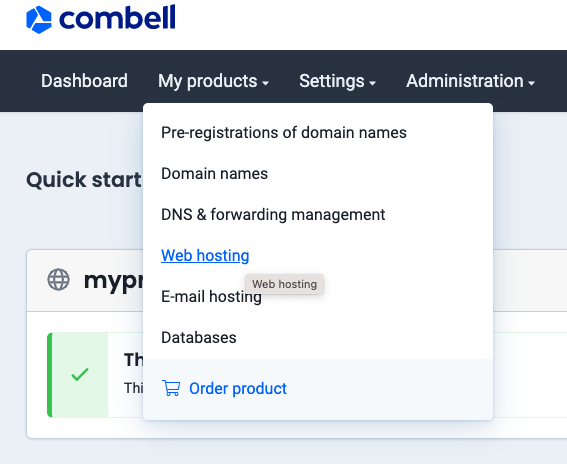
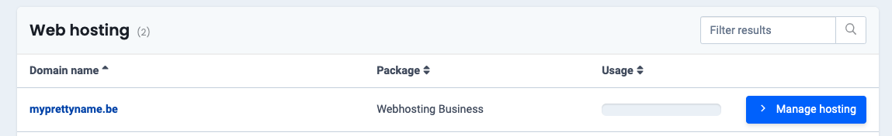
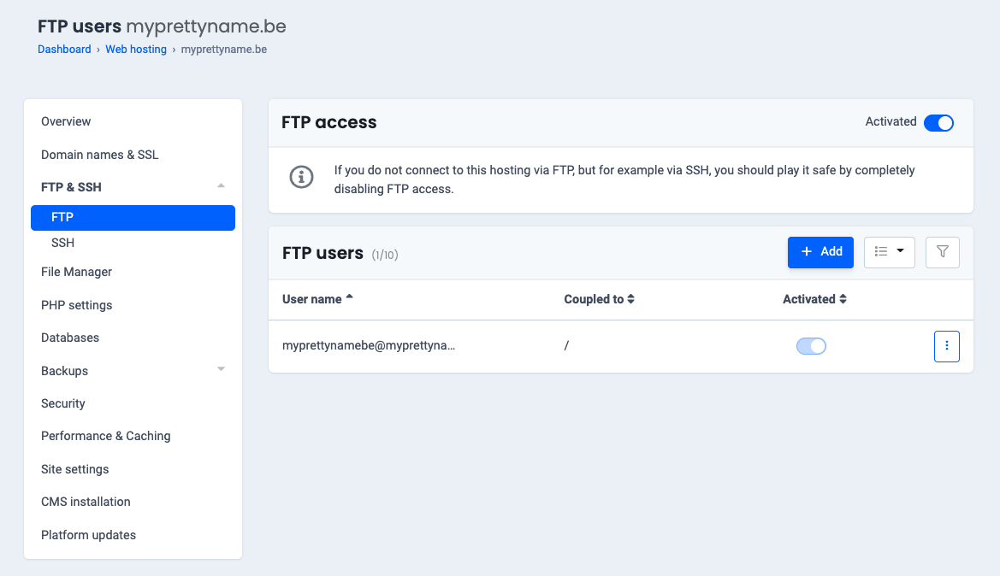
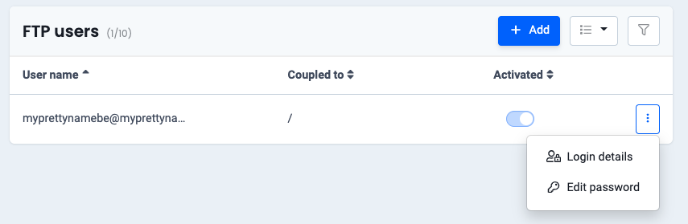
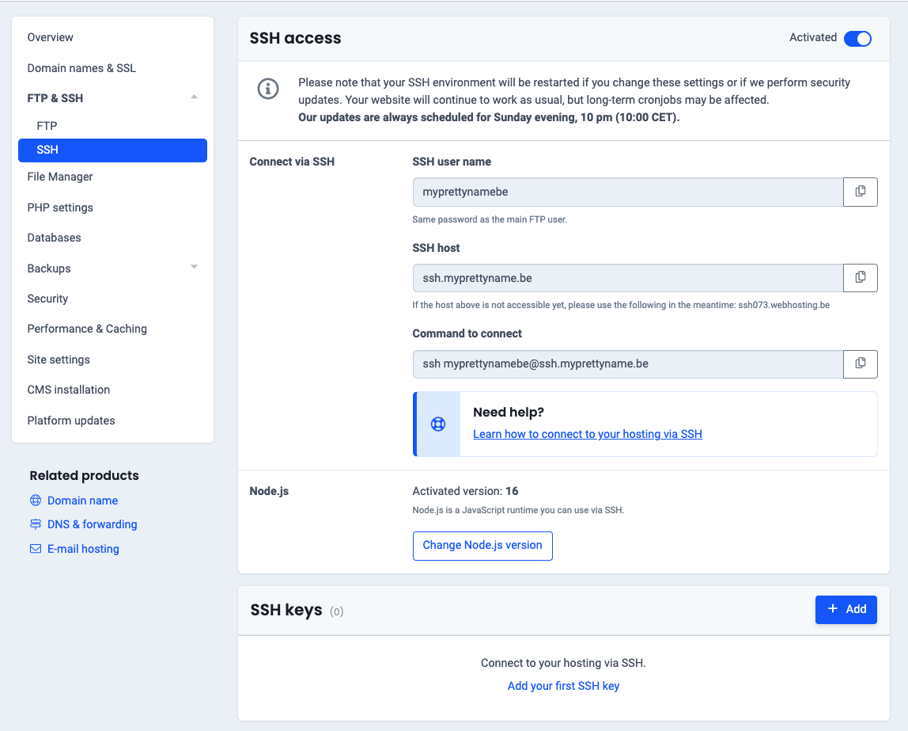
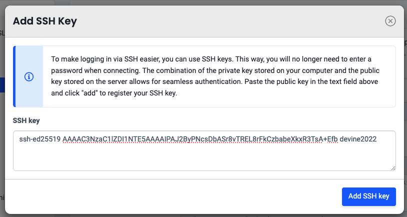

In this step you will use the dashboard of your hosting to adjust some settings so that you can connect with an FTP client. This is an application that allows you to upload files to a web server and to manage those files on the server.

## FTP User

First thing to do is set up an FTP user. Navigate to [Combell](https://my.combell.com/en/home) and log in with your combell account if necessary. You see the dashboard of your account. Click on the item `Web hosting`. Click the `Manage hosting` button next to your domain name. You can browse through the details if you want to.

Find the item `FTP & SSH` in the menu click on it and click on `FTP`. There is a default FTP user activated. The only thing you need to do is set a password for that user. This can be the same password as your combell account, although this is not required and even not recommended for security reasons.

Click the 3 dots next to the default user and click `Edit password`. A popup will appear where you can set the password.

Also check the username. This is normally the name of your domain without a dot between the name and the extension. You will need this name in the next step.

## Activate SSH

Your lecturers need to be able to access your hosting to check the date that something was last uploaded. We do this by using SSH keys.

Click `Add`, to add a new SSH key. Download [devine2022.pub](https://leho-howest.instructure.com/courses/15779/files/2830313?module_item_id=583445). You can open this file with VS Code and copy/paste the content. Click `Add SSH key`, to complete.

NOTE: we only access your hosting to check the date of the final upload. We do not upload or modify any content on your hosting. Select the `SSH` option from the menu. Activate SSH access by moving the switch. It can take a while until SSH is activated.

