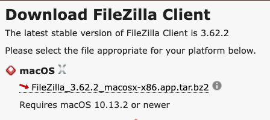
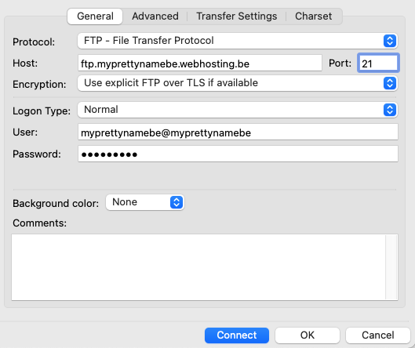
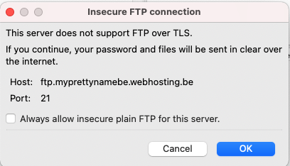
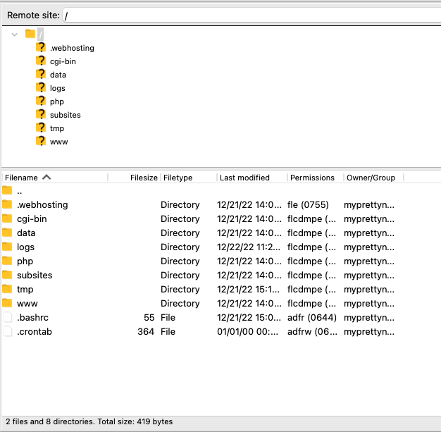

In this step you will install an FTP client. This is an application that allows you to upload files to a web server and to manage those files on the server. We use [FilleZilla](https://filezilla-project.org/) in Devine because it is an open source and free FTP client that is easy to use. However, there are a lot of other alternatives available.

## Install

Navigate to [FileZilla](https://filezilla-project.org/download.php?show_all=1) and select `Mac Os X`. Click on  `FileZilla_3.62.2_macosx-x86.app.tar.bz2` file to extract the file. Click on the file to decompress. Drag FileZilla.app to the Applications folder.

You will probably see a warning message the first time you start FileZilla. This is because you downloaded the application from the web. Just click the `Open` button.

## Configure

You need the following to upload to a web server:

1. **A host**: this is the web server to where the files need to be uploaded
2. **Username** and password: to indicate that you have access to the server
3. **Port number**: this is always 21 for FTP

Open FileZilla and select `File → Site Manager…`  or use the shortcut `CMD + S`.   Click the button `New Site`, give your hosting a name and insert the following data:

- **Protocol** is FTP
- **Host** is ftp.yourdomainname.webhosting.be**
- **Port** is 21
- **User**: normally your domain name, followed by be without a dot. Check your Combell settings for this.
- **Password**:
the password that you have set in the Combell dashboard for the FTP user

Click "Connect". You will see the following warning. Just check the "Always allow" box and click "OK".

You should see an overview of the folder structure of the server on the right side of your screen. Your local folder structure is on the left side.
Check your settings again if you see an error message. Mostly it is because you made a typo in the name of the host, username or password.

