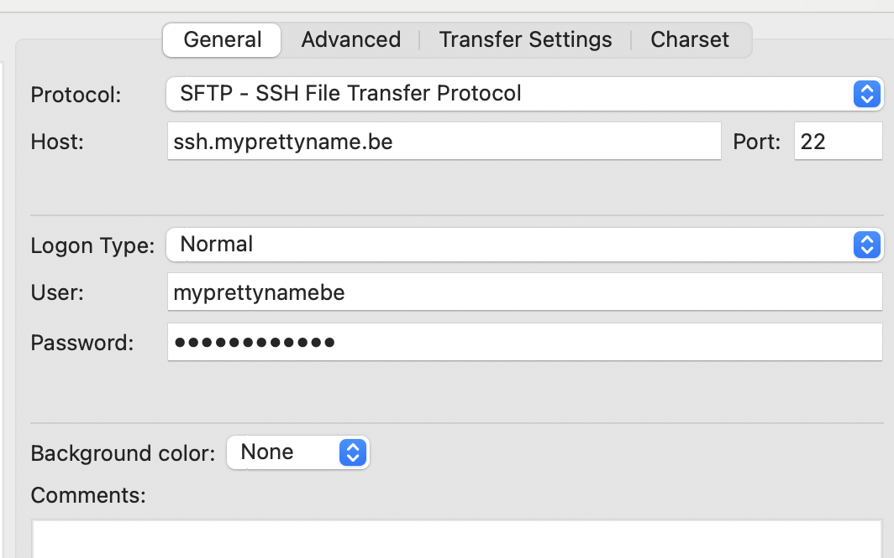

In this step you will install an FTP client. This is an application that allows you to securely upload files to a web server and to manage those files on the server. We use [FileZilla](https://filezilla-project.org/) in Devine because it is an open source and free SFTP client that is easy to use. However, there are a lot of other alternatives available.

## Install

Navigate to [FileZilla](https://filezilla-project.org/download.php?show_all=1). Download the version `FileZilla Client` for your operating system. Make sure to download the client and not the server version.

If you don't know if you have and intel or apple silicon Mac, you can check this by clicking the Apple logo in the top left corner of your screen and selecting `About This Mac`. The information about your processor will be displayed in the window that appears.

Unzip the downloaded file and move the FileZilla application to your Applications folder. Start FileZilla by double clicking the application icon.

You will probably see a warning message the first time you start FileZilla. This is because you downloaded the application from the web. Just click the `Open` button.

## Configure

You need the following to upload to a web server:

1. **A host**: this is the web server to where the files need to be uploaded
2. **Username** and password: to indicate that you have access to the server
3. **Port number**: this is always 22 for SFTP

Open FileZilla and select `File → Site Manager…`  or use the shortcut `CMD + S`.   Click the button `New Site`, give your hosting a name and insert the following data:

You can find these settings in your Combell dashboard under **FTP & SSH**:

- **Protocol** is SFTP - SSH File Transfer Protocol
- **Host** is ssh.yourdomainname.be (replace `yourdomainname.be` with your actual domain name)
- **Port** is 22
- **User**: normally your domain name, followed by be without a dot. Check your Combell settings for this.
- **Password**:
the password that you have set in the Combell dashboard for the FTP user

Click "Connect". You may see a warning about an unknown host key the first time you connect. Just check the "Always trust this host" box and click "OK".

You should see an overview of the folder structure of the server on the right side of your screen. Your local folder structure is on the left side.
Check your settings again if you see an error message. Mostly it is because you made a typo in the name of the host, username or password.

